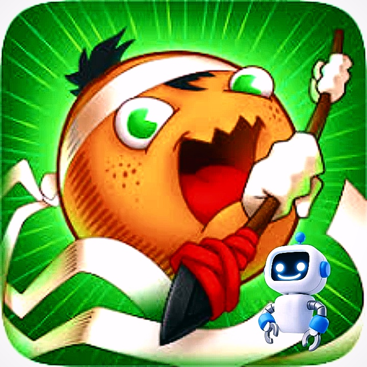

 
# Fruitcrafts Bot:
FruitCraft Bot: An Intelligent Automated Player for FruitCraft Game

## Description:
FruitCraft Bot is an advanced AI bot designed to play the FruitCraft game autonomously. Leveraging cutting-edge machine learning algorithms, this bot can make strategic decisions and navigate the game environment with remarkable intelligence and efficiency.

# Features:
- **Autonomous Gameplay:** FruitCraft Bot plays the game automatically without any human intervention.
- **Smart Decision Making:** Utilizes sophisticated algorithms to make strategic decisions in real-time.
- **Adaptive Learning:** Learns from gameplay experiences to continually improve its performance.
- **Efficient Navigation:** Navigates through game levels with precision and speed.
- **User-Friendly Interface:** Offers a simple and intuitive interface for easy interaction with users.

## Installation and Usage:
To use FruitCraft Bot, simply deploy it to your preferred platform and let it run. Users can observe its gameplay or interact with it through commands for additional features.

# License:
This project is released under the [MIT License](https://opensource.org/licenses/MIT).

##

# ربات فروت کرفت :
ربات فروت کرفت: یک بازیکن هوشمند و اتوماتیک برای بازی فروت کرفت

## توضیحات:
ربات فروت کرفت یک هوش مصنوعی پیشرفته است که برای بازی اتوماتیک در بازی فروت کرفت طراحی شده است. با بهره‌گیری از الگوریتم‌های پیشرفته یادگیری ماشین، این ربات می‌تواند تصمیمات استراتژیکی بپذیرد و با هوش و کارایی قابل توجهی در محیط بازی عمل کند.

# ویژگی‌ها:
- **بازی اتوماتیک:** ربات فروت کرفت بدون نیاز به دخالت انسانی در بازی فعالیت می‌کند.
- **تصمیم‌گیری هوشمندانه:** از الگوریتم‌های پیشرفته برای تصمیم‌گیری استراتژیک در زمان واقعی استفاده می‌کند.
- **یادگیری تطبیقی:** از تجربیات بازی برای بهبود مداوم عملکرد خود استفاده می‌کند.
- **ناوبری کارآمد:** با دقت و سرعت از سطوح بازی عبور می‌کند.
- **رابط کاربری ساده:** رابطی ساده و محیطی ازمایشگاهی برای تعامل آسان با کاربران ارائه می‌دهد.

## نصب و استفاده:
برای استفاده از ربات فروت کرفت، آن را در پلتفرم مورد نظر خود استقرار دهید و اجازه دهید کار کند. کاربران می‌توانند بازی را مشاهده کنند یا از طریق دستورات با آن تعامل داشته باشند.

# لایسنس:
این پروژه تحت [لایسنس MIT](https://opensource.org/licenses/MIT) منتشر شده است.
---

  &nbsp;&nbsp;&nbsp;
  &nbsp;&nbsp;&nbsp;
  

